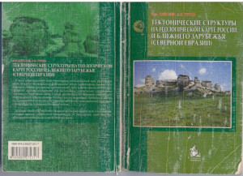

= Региональная Геология

== Описание дисциплины(нужна вставка)
=== Список заданий для студентов 4 курса

==== Список заданий Осеннего семестра

===== https://mgri-university.github.io/reggeo/images/geokniga-tektonicheskie-struktury.pdf[В.М.Цейслер, А.В.Туров Тектонические структуры на геологической карте россии и ближнего зарубежья (северной евразии)]

==== Section Level 3

===== Section Level 4

====== Section Level 

= Section Level 0
